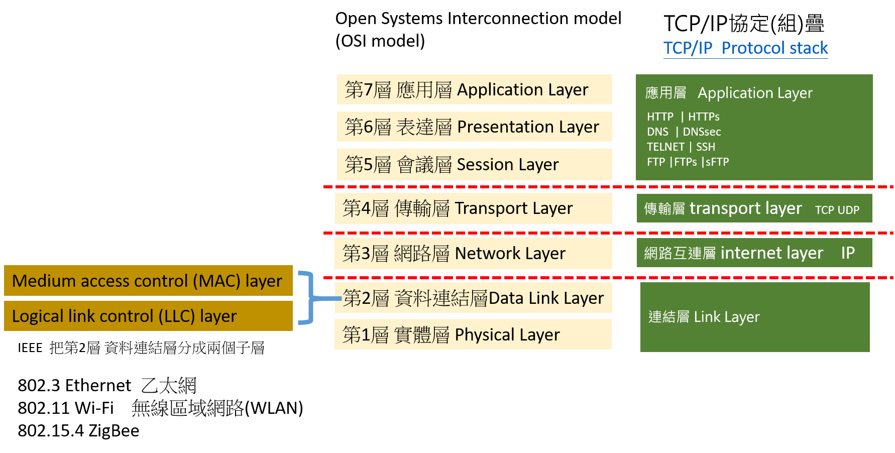

# 網路協議

# [OSI協定](https://zh.wikipedia.org/wiki/OSI%E6%A8%A1%E5%9E%8B#%E7%AC%AC1%E5%B1%A4_%E5%AF%A6%E9%AB%94%E5%B1%A4)
## 第一層 實體層（Physical Layer）
- 它負責管理電腦通訊裝置和網路媒體之間的互通。集線器、中繼器、網卡、主機介面卡等。

# TCP/IP協定
